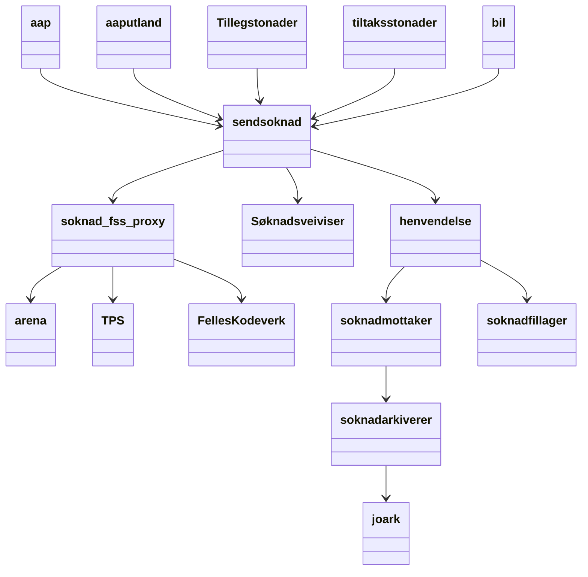
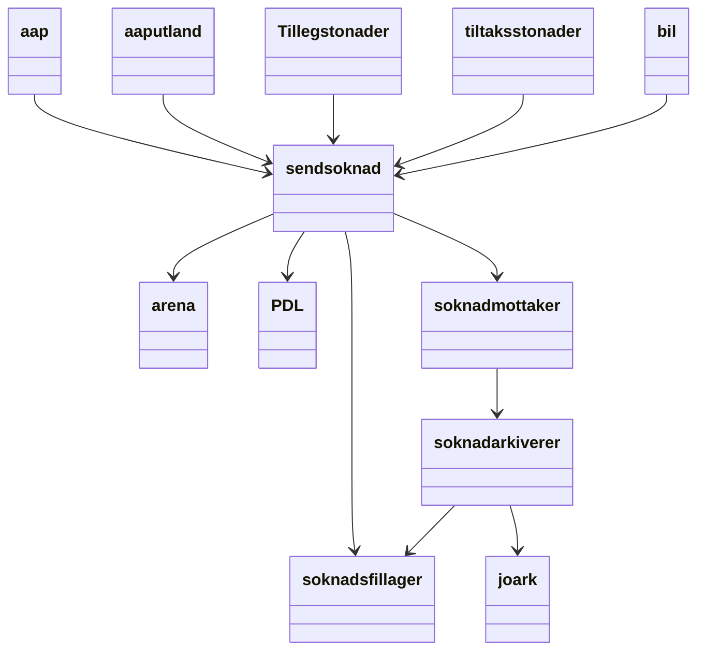
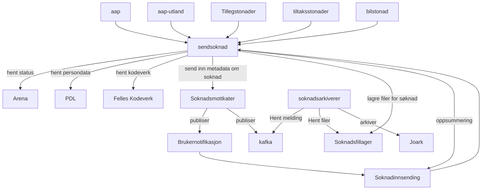

## Avhengiheter for søknadene

### I dag
<!--- #my-section --->
dagens arkitektur

<!--- #my-section --->
#### Transisjonsarkitektur
- [soknad_ffs-proxy](https://github.com/navikt/soknad-fss-proxy) er tatt i bruk som midlertidig proxy mot eldre soaptjenster, tjenstene skal erstattes av tilbudte resttjenster.
- *henvendelse* skal saneres og sendsøknad skal gå direkte mot [soknadsfillager](https://github.com/navikt/soknadsfillager) og [soknadsmottaker](https://github.com/navikt/soknadsmottaker)

### To be

Alternativ fremstsilling 
