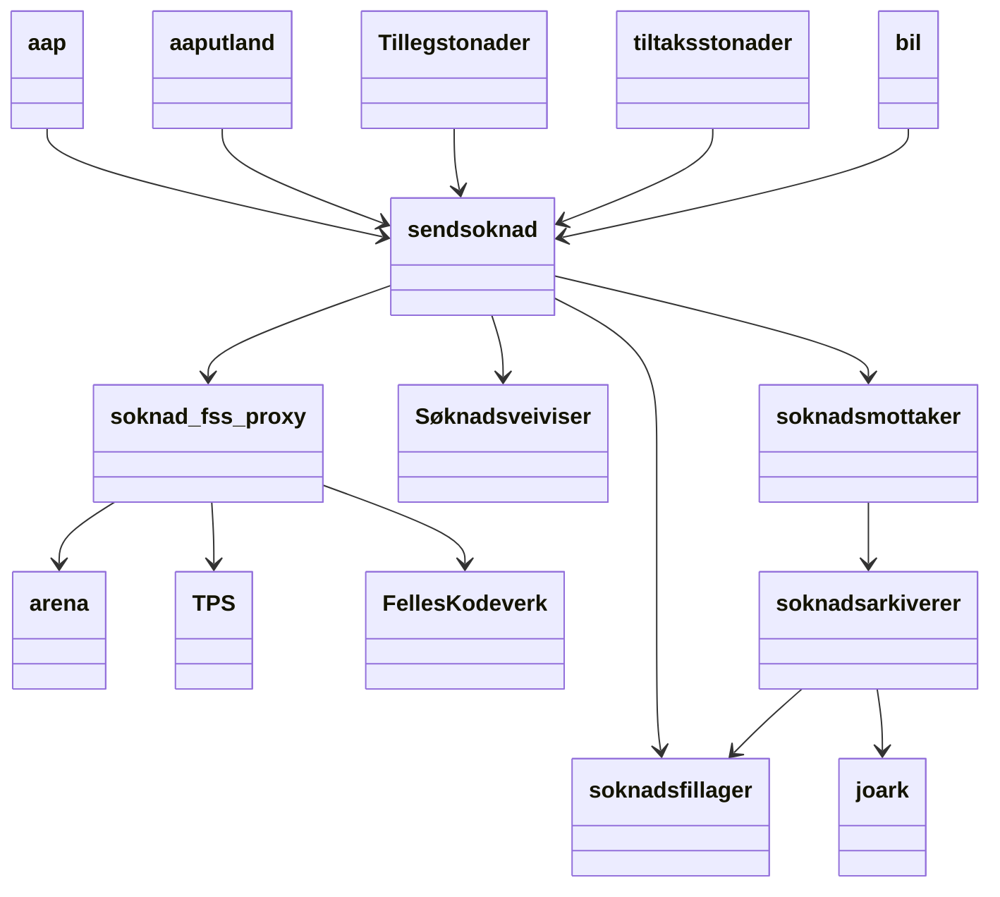
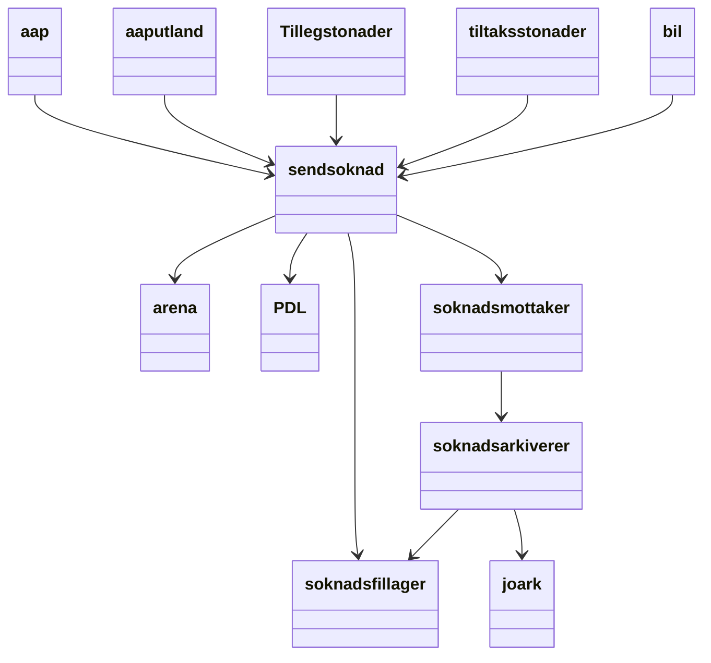
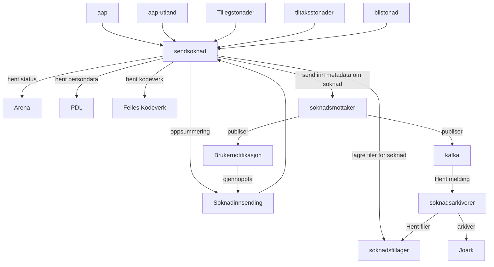

## Avhengiheter for søknadene

### I dag
dagens arkitektur

#### Transisjonsarkitektur
- [soknad_ffs-proxy](https://github.com/navikt/soknad-fss-proxy) er tatt i bruk som midlertidig proxy mot eldre soaptjenster, tjenstene skal erstattes av tilbudte resttjenster.

### To be

Alternativ fremstilling

