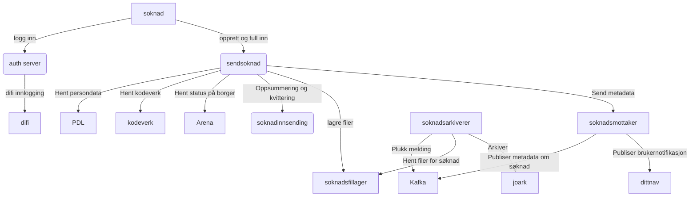

## Avhengiheter for søknadene  

### AAP eksempel

```mermaid
graph TD
    A[soknad] -->|logg inn| B(auth server)
    A --> |opprett og full inn| C(sendsoknad)
    B --> |difi innlogging| D[difi]
    C -->|Hent persondata| E[PDL]
    C -->|Hent kodeverk| F[kodeverk]
    C -->|Hent status på borger| G[Arena]
    C -->|Oppsummering og kvittering| H(soknadinnsending)
    C -->|lagre filer| I[soknadsfillager]
    C -->|Send metadata| J[soknadsmottaker]
    J -->|Publiser metadata om søknad| K[Kafka]
    J -->|Publiser brukernotifikasjon| M[dittnav]
    L[soknadsarkiverer] -->|Plukk melding| K
    L -->|Hent filer for søknad| I
    L -->|Arkiver| N[joark]  
```