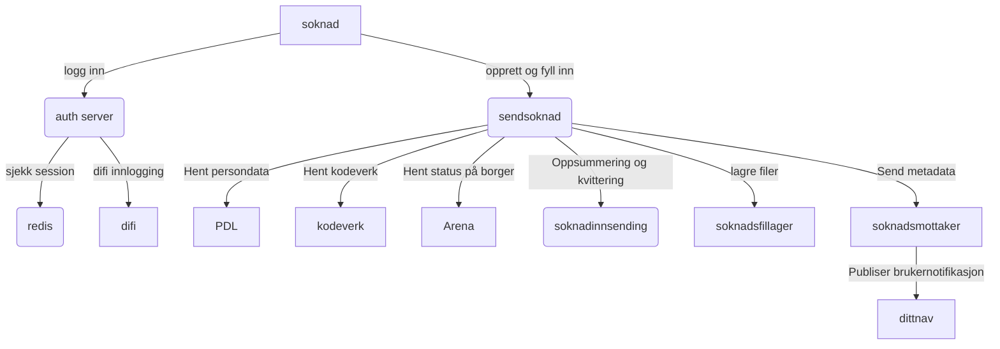
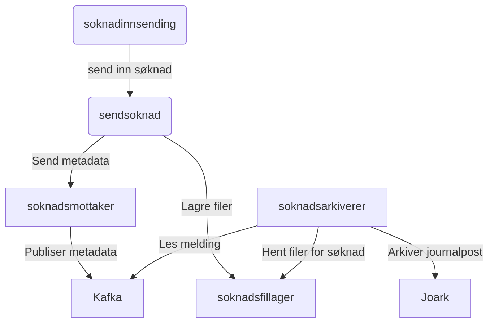
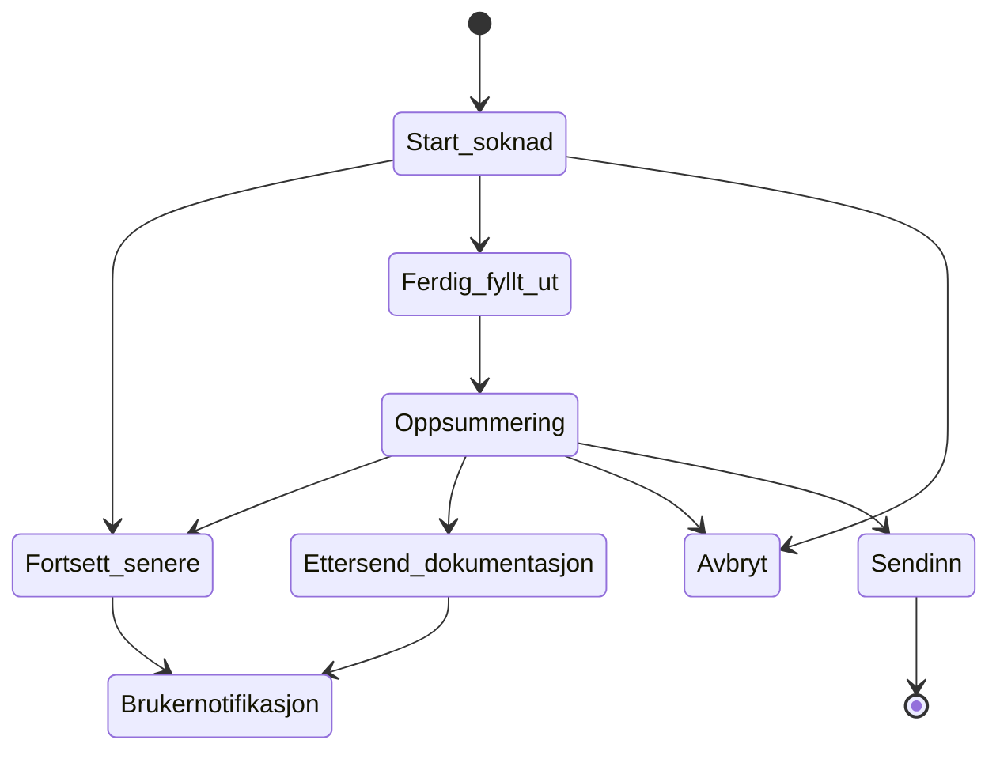
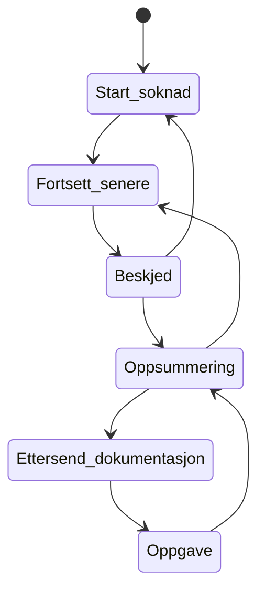

## Avhengiheter for søknadene  

### AAP eksempel

#### Søknad opprettelse og under utfylling

#### Søknad arkiveres

#### Brukernotifikasjoner og muligheter for bruker å stoppe under innsengding

##### Brukernotifikasjoner
* En bruker kan velge å fortsette senere under utfylling av selve søknaden eller under oppsummeringen.
* En bruker kan velge å etterende påkrevd dokumentasjon under oppsummeringen.
* En bruker kan velge å avbryte søknad når som helst.
* En bruker får en beskjed på dittnav når den velger å fortsette senere.
* En bruker får en oppgave på dittnav når den velger å ettersende påkrevd dokumentasjon.

