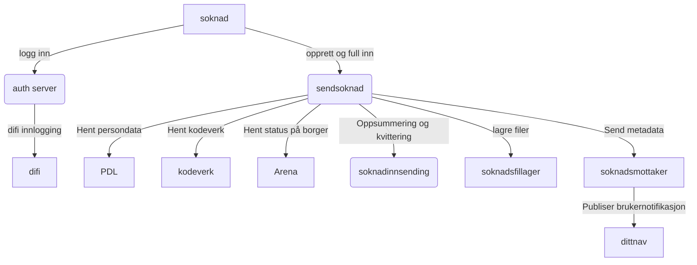
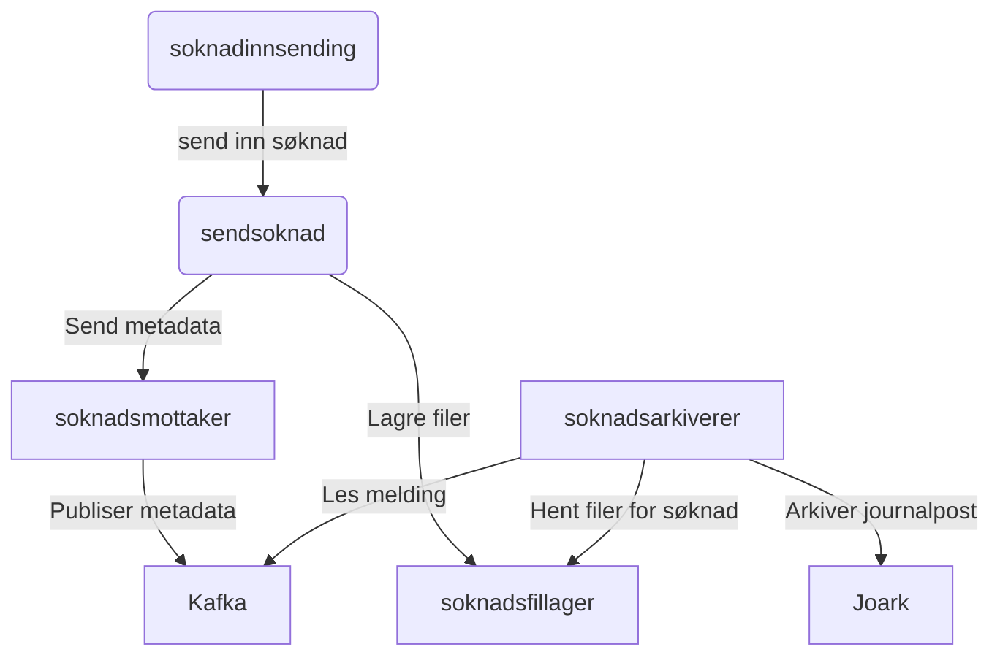
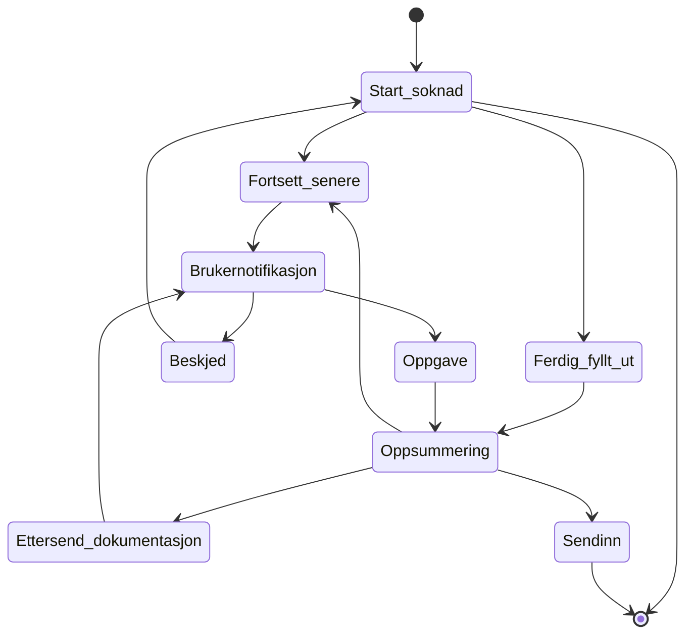
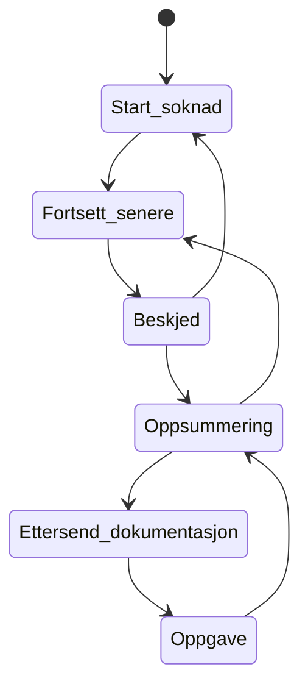

## Avhengiheter for søknadene  

### AAP eksempel

#### Søknad opprettelse og under utfylling

#### Søknad arkiveres

#### Brukernotifikasjoner og muligheter for bruker å stoppe under innsending

##### Brukernotifikasjoner
* En bruker kan velge å fortsette senere under utfylling av selve søknaden eller under oppsummeringen
* En bruker kan velge å etterende påkrevd dokumentasjon under oppsummeringen.
