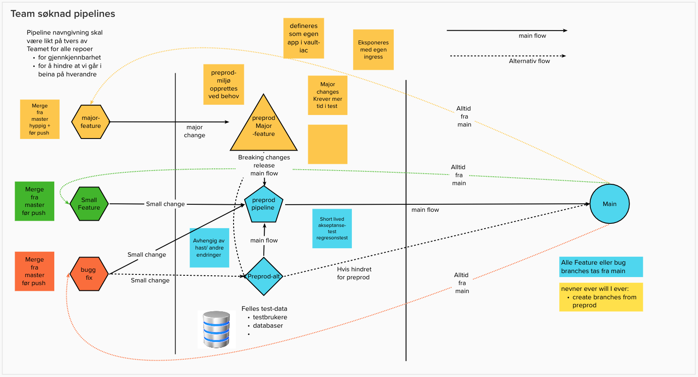
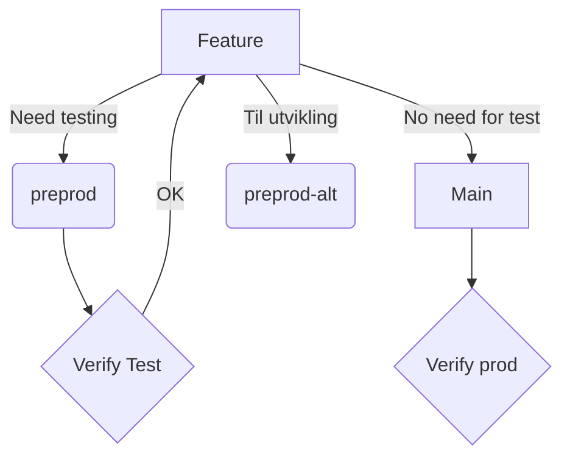

## Pipelines

### Trunk based development

#### Behov for testing

```mermaid
flowchart TD
    A[Feature] -->|Need testing| B(preprod)
    B --> C{Verify Test}
    A -->|No need for test| D[Main]
    D --> E{Verify prod}
    C --> |OK| A  
    A -->|Til utvikling|F(preprod-alt)
```
