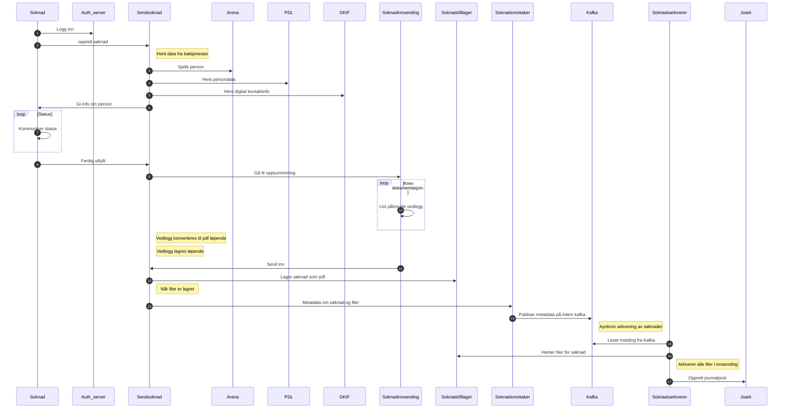

# Fra opprettelse av søknad til arkivering av innsending
Diagrammet inkluderer ende til ende fra en søknad er opprettet til den er arkivert.

```mermaid
sequenceDiagram
autonumber
Soknad->>Auth_server: Logg inn
Soknad->>Sendsoknad: opprett søknad
Note right of Sendsoknad: Hent data fra baktjenester
Sendsoknad->>Arena: Sjekk person
Sendsoknad->>PDL: Hent persondata
Sendsoknad->>DKIF: Hent digital kontaktinfo
Sendsoknad->>Soknad: Gi info om person
loop Status
Soknad->>Soknad: Kommuniser status
end
Soknad->>Sendsoknad: Ferdig utfyllt
Sendsoknad->>Soknadinnsending: Gå til oppsummering
loop Krev dokumentasjon
Soknadinnsending->>Soknadinnsending: List påkrevde vedlegg
end
Note right of Sendsoknad: Vedlegg konverteres til  pdf løpende
Note right of Sendsoknad: Vedlegg lagres løpende
Soknadinnsending->>Sendsoknad: Send inn
Sendsoknad->>Soknadsfillager: Lagre søknad som pdf
Note right of Sendsoknad: Når filer er lagret
Sendsoknad->>Soknadsmottaker: Metadata om søknad og filer
Soknadsmottaker->>Kafka: Publiser metadata på intern kafka
Note left of Soknadsarkiverer: Aynkron arkivering av søknader
Soknadsarkiverer->>Kafka: Leser melding fra Kafka
Soknadsarkiverer->>Soknadsfillager: Henter filer for søknad
Note right of Soknadsarkiverer: Arkiverer alle filer i innsending
Soknadsarkiverer->>Joark: Opprett journalpost
```